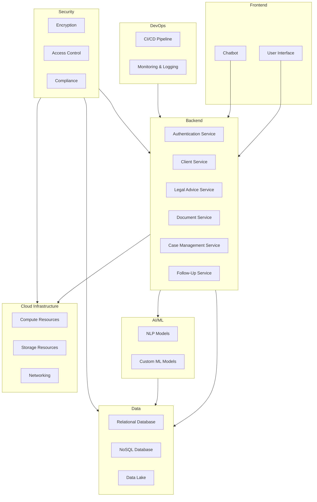
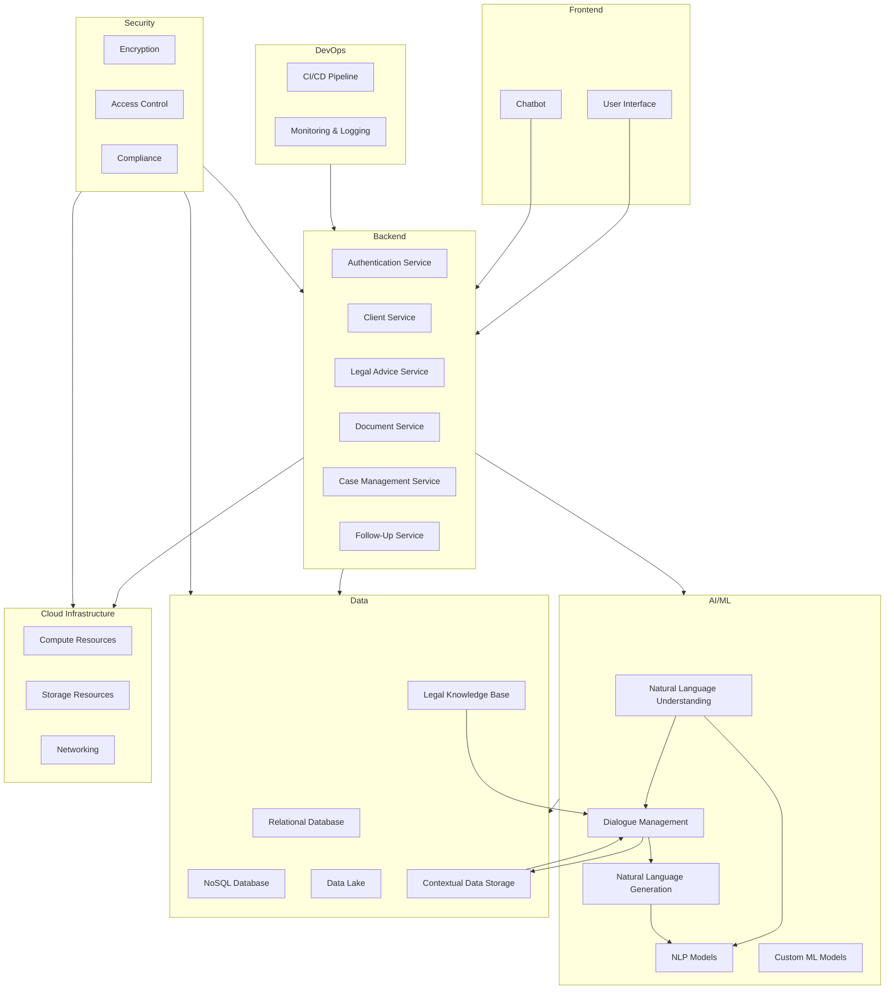

### Design of a Virtual Firm
 we can design a Housing Legal Advisory Virtual Firm that mirrors the structure of the Agent Hospital. The firm will involve various autonomous agents representing different roles within a legal advisory firm. These agents will interact with clients and each other to provide comprehensive legal services. Here are the necessary characters or personas and the functional components of the virtual organization:

### Functional Components of the Virtual Firm

1. **Client Intake and Registration**
   - **Receptionist Agent**: Handles initial client intake, gathers preliminary information, and registers new clients.
   - **Triage Agent**: Assesses the client's legal needs and directs them to the appropriate legal professional.

2. **Consultation and Legal Advice**
   - **Legal Advisor Agents**: Provide expert legal advice in various areas such as housing disputes, landlord-tenant issues, property law, etc.
   - **Paralegal Agents**: Assist legal advisors by conducting research, preparing documents, and managing case files.

3. **Case Management and Follow-Up**
   - **Case Manager Agents**: Oversee the progress of each case, ensuring all necessary steps are taken and deadlines are met.
   - **Follow-Up Agents**: Contact clients for updates, gather additional information, and ensure client satisfaction.

4. **Document Preparation and Review**
   - **Document Specialist Agents**: Draft and review legal documents, contracts, and agreements.
   - **Compliance Agents**: Ensure all documents and processes comply with relevant laws and regulations.

5. **Dispute Resolution**
   - **Mediation Agents**: Facilitate negotiations and mediations between disputing parties.
   - **Litigation Agents**: Represent clients in court if disputes escalate to legal proceedings.

6. **Knowledge Management and Continuous Improvement**
   - **Knowledge Base Agents**: Maintain and update a repository of legal knowledge, case precedents, and best practices.
   - **Training Agents**: Provide continuous training and development to other agents based on accumulated knowledge and experience.

### Example Personas

1. **Receptionist Agent (Rachel)**
   - **Role**: Initial point of contact for clients.
   - **Responsibilities**: Client intake, information gathering, registration.
   - **Skills**: Communication, empathy, organization.

2. **Triage Agent (Tom)**
   - **Role**: Assess client needs and direct them to the appropriate legal professional.
   - **Responsibilities**: Initial assessment, client triage, scheduling consultations.
   - **Skills**: Analytical thinking, decision-making, client service.

3. **Legal Advisor Agent (Laura)**
   - **Role**: Provide expert legal advice.
   - **Responsibilities**: Client consultations, legal research, advice provision.
   - **Specialization**: Housing disputes, landlord-tenant issues.
   - **Skills**: Legal expertise, critical thinking, problem-solving.

4. **Paralegal Agent (Paul)**
   - **Role**: Assist legal advisors.
   - **Responsibilities**: Research, document preparation, case management.
   - **Skills**: Research, writing, attention to detail.

5. **Case Manager Agent (Cathy)**
   - **Role**: Oversee case progress.
   - **Responsibilities**: Case tracking, deadline management, client communication.
   - **Skills**: Project management, communication, organization.

6. **Follow-Up Agent (Frank)**
   - **Role**: Ensure client satisfaction and gather updates.
   - **Responsibilities**: Client follow-up, information gathering, feedback collection.
   - **Skills**: Communication, empathy, persistence.

7. **Document Specialist Agent (Diana)**
   - **Role**: Draft and review legal documents.
   - **Responsibilities**: Document preparation, review, editing.
   - **Skills**: Legal writing, attention to detail, compliance knowledge.

8. **Compliance Agent (Carl)**
   - **Role**: Ensure compliance with laws and regulations.
   - **Responsibilities**: Compliance checks, document review, policy updates.
   - **Skills**: Legal knowledge, attention to detail, regulatory awareness.

9. **Mediation Agent (Megan)**
   - **Role**: Facilitate dispute resolution.
   - **Responsibilities**: Mediation, negotiation, conflict resolution.
   - **Skills**: Mediation, negotiation, communication.

10. **Litigation Agent (Leo)**
    - **Role**: Represent clients in court.
    - **Responsibilities**: Legal representation, case preparation, court appearances.
    - **Skills**: Litigation, advocacy, legal strategy.

11. **Knowledge Base Agent (Kevin)**
    - **Role**: Maintain legal knowledge repository.
    - **Responsibilities**: Knowledge management, updates, best practices.
    - **Skills**: Information management, research, organization.

12. **Training Agent (Tina)**
    - **Role**: Provide training and development.
    - **Responsibilities**: Training sessions, skill development, continuous improvement.
    - **Skills**: Training, development, communication.

### Simulation Process

1. **Client Interaction Cycle**
   - **Client Onboarding**: Rachel registers the client and gathers preliminary information.
   - **Needs Assessment**: Tom assesses the client's legal needs and directs them to Laura for a consultation.
   - **Consultation**: Laura provides legal advice, supported by research from Paul.
   - **Case Management**: Cathy oversees the case progress, ensuring all steps are completed.
   - **Follow-Up**: Frank contacts the client for updates and gathers feedback.

2. **Document Handling Cycle**
   - **Document Preparation**: Diana drafts necessary legal documents.
   - **Compliance Check**: Carl reviews documents to ensure compliance with laws.
   - **Case Progress**: Documents are used in mediation or litigation as needed.

3. **Knowledge and Training Cycle**
   - **Knowledge Update**: Kevin updates the knowledge base with new information and best practices.
   - **Training**: Tina conducts training sessions for agents based on updated knowledge.

This structure ensures that the virtual firm operates efficiently, providing high-quality legal services while continuously improving through knowledge accumulation and agent training.

---

## high level design of the project ##

High level design of the project please suggest the tech side recommendations to realize and bring this project to life.
To bring the Housing Legal Advisory Virtual Firm to life, we need to design a robust technical architecture that leverages modern technologies for AI, cloud computing, data management, and user interaction. Below are the high-level technical recommendations for realizing this project:

### 1. **Core Technologies**

#### A. **Large Language Model (LLM) Integration**
- **Models**: Use OpenAI's GPT-4 or similar advanced LLMs for natural language understanding and generation.
- **APIs**: Integrate LLM APIs for various agent functionalities, such as client interaction, legal advice, document generation, and compliance checks.

#### B. **Cloud Infrastructure**
- **Provider**: Use a cloud service provider like AWS, Azure, or Google Cloud for scalable infrastructure.
- **Services**:
  - **Compute**: EC2 (AWS), VM Instances (GCP), or Virtual Machines (Azure) for running AI models and backend services.
  - **Storage**: S3 (AWS), Blob Storage (Azure), or Cloud Storage (GCP) for storing documents, case files, and knowledge base.
  - **Database**: Managed databases like RDS (AWS), Cloud SQL (GCP), or Azure SQL Database for structured data storage.

#### C. **Containerization and Orchestration**
- **Containers**: Use Docker for containerizing applications to ensure consistency across different environments.
- **Orchestration**: Kubernetes for managing containerized applications, ensuring scalability and reliability.

### 2. **Application Architecture**

#### A. **Microservices Architecture**
- **Services**: Design the application as a set of microservices, each responsible for specific functionalities (e.g., client intake, legal advice, document management).
- **Communication**: Use RESTful APIs or gRPC for inter-service communication.

#### B. **Backend Services**
- **Framework**: Use a backend framework like Node.js, Django, or Spring Boot for developing microservices.
- **Authentication**: Implement OAuth 2.0 or JWT for secure authentication and authorization.

#### C. **Frontend Development**
- **Framework**: Use modern frontend frameworks like React, Angular, or Vue.js for building responsive and interactive user interfaces.
- **State Management**: Use Redux (React), NgRx (Angular), or Vuex (Vue.js) for state management.

### 3. **Data Management**

#### A. **Database Design**
- **Relational Database**: For structured data such as client information, case details, and appointment schedules.
- **NoSQL Database**: For unstructured data, such as chat logs, document drafts, and knowledge base articles.

#### B. **Data Integration**
- **ETL Processes**: Implement Extract, Transform, Load (ETL) processes for integrating data from various sources into a central repository.
- **Data Lake**: Use data lake solutions like AWS Lake Formation or Google BigQuery for storing and analyzing large volumes of data.

### 4. **AI and Machine Learning**

#### A. **Model Training and Deployment**
- **Training**: Use platforms like SageMaker (AWS), AI Platform (GCP), or Azure Machine Learning for training custom models.
- **Deployment**: Deploy models as RESTful services using containerized environments for scalability.

#### B. **Natural Language Processing (NLP)**
- **Pre-trained Models**: Utilize pre-trained models for tasks like entity recognition, sentiment analysis, and text summarization.
- **Custom Models**: Train custom models for specific legal tasks such as document classification, legal question answering, and compliance checking.

### 5. **DevOps and CI/CD**

#### A. **Continuous Integration/Continuous Deployment (CI/CD)**
- **Tools**: Use tools like Jenkins, GitHub Actions, or GitLab CI for automating the build, test, and deployment processes.
- **Pipeline**: Implement CI/CD pipelines to ensure code quality and rapid deployment of new features.

#### B. **Monitoring and Logging**
- **Monitoring**: Use monitoring tools like Prometheus, Grafana, or CloudWatch (AWS) for tracking application performance and health.
- **Logging**: Implement centralized logging using ELK Stack (Elasticsearch, Logstash, Kibana) or similar solutions for troubleshooting and audit trails.

### 6. **Security and Compliance**

#### A. **Data Security**
- **Encryption**: Ensure data encryption at rest and in transit using SSL/TLS and other encryption standards.
- **Access Control**: Implement role-based access control (RBAC) to restrict access to sensitive data and functionalities.

#### B. **Compliance**
- **Regulations**: Ensure compliance with legal and regulatory requirements such as GDPR, HIPAA, and other relevant standards.
- **Auditing**: Implement auditing mechanisms to track access and modifications to sensitive data.

### 7. **User Experience**

#### A. **User Interface (UI) Design**
- **Design Principles**: Follow modern UI design principles for a clean, intuitive, and responsive user interface.
- **Accessibility**: Ensure the application is accessible to users with disabilities by adhering to WCAG guidelines.

#### B. **User Interaction**
- **Chatbots**: Implement chatbots for initial client interactions and FAQs using conversational AI.
- **Notifications**: Use push notifications, email, and SMS for client updates and reminders.

### 8. **Collaboration and Communication**

#### A. **Collaboration Tools**
- **Tools**: Integrate collaboration tools like Slack, Microsoft Teams, or Zoom for internal communication and client meetings.
- **Document Sharing**: Implement secure document sharing and collaborative editing features for client and team interactions.

### High-Level Architecture Diagram

## High Level Design ##
This high-level design and technical recommendations should provide a solid foundation for developing the Housing Legal Advisory Virtual Firm. Each component can be further detailed and refined during the implementation phase to ensure the system meets all functional and non-functional requirements.
 here is the corrected high-level architecture diagram using Mermaid syntax:

## Mimicing Real life chat interaction ##

To mimic a real doctor-like conversation and enable a two-way interaction between the conversational agent and the client, we need to implement several additional components and ensure that the conversational agent can dynamically ask questions, understand responses, and provide relevant advice. Here are the key components and steps to achieve this:

### Key Components for Two-Way Conversation

1. **Conversational Agent Framework**
   - **Natural Language Understanding (NLU)**: To interpret and understand client responses.
   - **Dialogue Management**: To manage the flow of conversation, including context management and question sequencing.
   - **Natural Language Generation (NLG)**: To generate appropriate and contextually relevant responses.

2. **Knowledge Base**
   - **Legal Knowledge Base**: A comprehensive repository of legal information, precedents, and FAQs to provide accurate advice.
   - **Contextual Data Storage**: To store the context of the conversation, including client responses and the current state of the dialogue.

3. **Client Profile Management**
   - **Client Information Storage**: To store client-specific information such as personal details, case history, and previous interactions.

4. **Feedback Loop**
   - **Client Feedback Mechanism**: To gather feedback from clients to improve the conversational agent's performance.

### Detailed Architecture

### Step-by-Step Conversation Flow

1. **Client Initiates Conversation**
   - The client starts the conversation through the UI or Chatbot.
   - The Chatbot authenticates the client using the Authentication Service.

2. **Conversational Agent Kickstarts Interaction**
   - The Dialogue Management component initializes the conversation, possibly using a predefined greeting or introduction.
   - Example: "Hello! How can I assist you with your housing legal issue today?"

3. **Understanding Client’s Initial Query**
   - The client's initial query is processed by the NLU component to extract intent and entities.
   - Example: Client says, "I need help with a landlord dispute."

4. **Dynamic Question Generation**
   - Based on the extracted intent, the Dialogue Management component determines the next question to ask.
   - The NLG component generates a natural language question.
   - Example: "Can you please provide more details about your dispute with the landlord?"

5. **Client Responds**
   - The client provides additional details.
   - The NLU component processes the response to extract relevant information.

6. **Context Management**
   - The Dialogue Management component updates the conversation context with the new information.
   - Contextual Data Storage is used to keep track of the conversation state.

7. **Iterative Questioning**
   - The Dialogue Management component continues to ask relevant questions based on the client's responses and the conversation context.
   - Example: "Has your landlord provided any written notice regarding the dispute?"

8. **Providing Legal Advice**
   - Once sufficient information is gathered, the Legal Service component, possibly assisted by NLP models, provides legal advice.
   - The NLG component generates the response.
   - Example: "Based on the information you provided, it seems you have grounds to file a complaint. Here are the steps you need to take..."

9. **Follow-Up and Case Management**
   - The Follow-Up Service component schedules any necessary follow-up actions or consultations.
   - The Case Management Service updates the client's case file with the new information.

10. **Client Feedback**
    - The Feedback Loop component gathers feedback from the client to improve future interactions.

### Additional Components for Realistic Interaction

- **Predefined Question Templates**: A set of predefined questions based on common legal issues to streamline the conversation.
- **Context-Aware Responses**: The ability to generate responses that take into account the entire conversation history.
- **Sentiment Analysis**: To gauge the client's emotional state and adjust the conversation tone accordingly.
- **Escalation Mechanism**: The ability to escalate complex cases to human legal advisors if the conversational agent reaches its limits.

By integrating these components and following the outlined steps, the conversational agent can effectively mimic a real doctor-like conversation, providing a dynamic and interactive experience for clients seeking legal advice.

